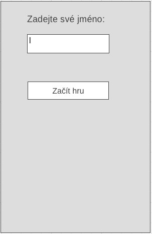
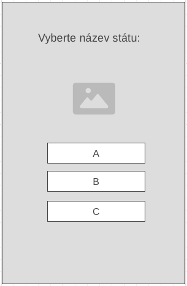
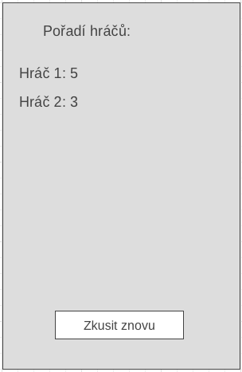

# Návrh a vývoj mobilních aplikací - zápočtová práce

Jednoduchá androidová aplikace, která umožňuje uživateli testovat své znalosti
o vlajkách různých států pomocí otázek s možností výběru. 

## Návrh aplikace

  

